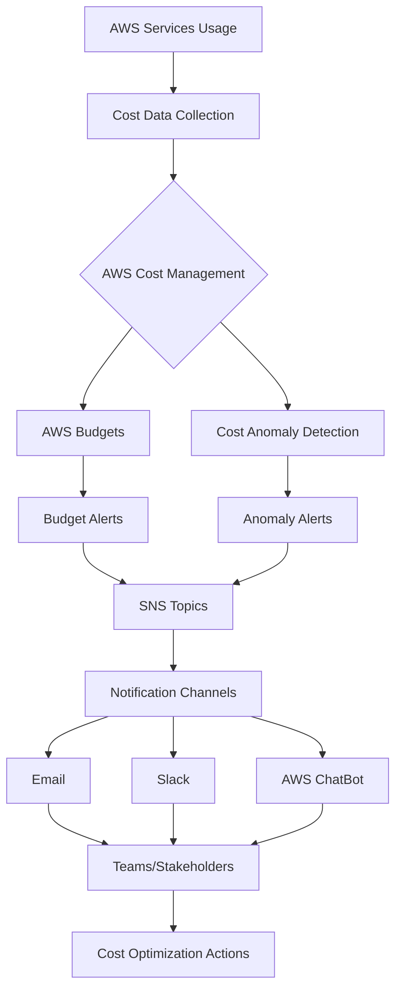

# AWS Budget and Cost Anomaly Alerts

---

## Document Metadata 

| **Author**   | **Created on** | **Version** | **Last updated on** | **Level** | **Reviewer**  |
|--------------|----------------|-------------|---------------------|-----------|---------------|
|Ashutosh Kumar| 2025-07-31     | 1.0          | 2025-07-31         | Internal  |Siddharth Pawar|

---

## Table of Contents
1. [Introduction](#introduction)
2. [What Are AWS Budget and Cost Anomaly Alerts?](#what-are-aws-budget-and-cost-anomaly-alerts)
3. [Why Use These Alerts?](#why-use-these-alerts)
4. [How Do They Work? (Workflow Architecture)](#how-do-they-work-workflow-architecture)
5. [Cost Optimization Measures](#cost-optimization-measures)
6. [Implementation Guide](#Implementation-Guide)
7. [Advantages](#advantages)
8. [Best Practices](#best-practices)
9. [Conclusion](#conclusion)
10. [Contact Information](#contact-information)
11. [References](#references)

---

## Introduction

Controlling cloud costs is a fundamental challenge for businesses, startups, and even individuals using AWS. **AWS Budgets** and **Cost Anomaly Alerts** are industry-standard tools designed for real-time cloud cost management, prevention of billing surprises, and governance. This documentation provides a simple yet comprehensive guide to these services, including workflow diagrams, practical tips, and professional standards.

---

## What Are AWS Budget and Cost Anomaly Alerts?

- **AWS Budgets**  
  AWS Budgets lets you set custom cost and usage budgets that alert you when your usage or spending exceeds (or is forecasted to exceed) your specified limits. You can track overall account spend, specific services, reserved instance utilization, and more.

    #### Types of AWS Budgets:
    1. **Cost Budgets**
       - Track all costs or specific services
       - Include or exclude categories like tax, refunds, or RI purchases
       
    2. **Usage Budgets**
       - Monitor service usage quantities
       - Track specific usage types or metrics
    
    3. **RI Budgets**
       - Monitor RI utilization and coverage
       - Optimize reservation investments
    
    4. **Savings Plans Budgets**
       - Track utilization and coverage
       - Optimize compute spending
    
    - **Official Documentation:** [AWS Budgets User Guide](https://docs.aws.amazon.com/cost-management/latest/userguide/budgets-managing-costs.html)

- **AWS Cost Anomaly Detection**  
  AWS Cost Anomaly Detection uses machine learning to identify unexpected or abnormal spending patterns in your AWS account. It notifies you about anomalies, their root causes, and impacted resources.
    Leverages Machine Learning to:
    - Continuously monitor spending patterns
    - Detect unusual spending behaviors
    - Provide root cause analysis
    - Generate intelligent alerts
    
    - **Official Documentation:** [AWS Cost Anomaly Detection](https://docs.aws.amazon.com/cost-management/latest/userguide/cost-anomaly-detection.html)
      
---

## Why Use These Alerts?

- ***Avoid Unexpected Costs:*** Get notified before overspending.
- ***Increase Accountability:*** Assign budgets to teams, projects, or clients.
- ***Improve Governance:*** Meet compliance and finance requirements.
- ***Optimize Resources:*** Discover unused or misconfigured resources.

These are essential for:
| Role/Department                | Why It's Essential                                                           |
|--------------------------------|------------------------------------------------------------------------------|
| Cloud Engineers                | For technical cost control, resource optimization, and monitoring.            |
| DevOps & SRE teams             | For operational monitoring, incident response, and automation.                |
| Finance/Procurement departments| For budgeting, cost tracking, compliance, and financial governance.           |
| Startups & Enterprises         | To ensure cloud cost efficiency, avoid billing surprises, and scale smoothly. |

---

## How Do They Work? (Workflow Architecture)



**Example Notification Channels:**  
- Email
- AWS SNS (for integration with Slack, SMS, etc.)
- AWS Chatbot (for Teams, Slack)

---

## Cost Optimization Measures

### Compute Optimization
- Right-size EC2 instances 
- Use Spot Instances for flexible workloads
- Implement Auto Scaling
- Utilize Compute Savings Plans

### Storage Optimization
- Apply S3 Lifecycle Policies
- Use S3 Intelligent-Tiering
- Optimize and clean up EBS volumes

### Database Optimization
- Select proper instance sizes/types
- Use Aurora Serverless for variable workloads
- Implement and monitor read replicas

### Networking Optimization
- Use VPC endpoints where possible
- Optimize data transfer paths
- Share NAT gateways to reduce costs

---

## Implementation Guide

### 1. Setting Up AWS Budgets
Follow the official documentation: [AWS Budgets Getting Started](https://docs.aws.amazon.com/cost-management/latest/userguide/budgets-getting-started.html)

**AWS CLI Example:**
```bash
aws budgets create-budget \
    --account-id 111122223333 \
    --budget file://budget.json \
    --notifications-with-subscribers file://notifications-with-subscribers.json
```

### 2. Configuring Cost Anomaly Detection
Official guide: [AWS Cost Anomaly Detection Getting Started](https://docs.aws.amazon.com/cost-management/latest/userguide/getting-started-ad.html)

Steps:
1. Go to AWS Cost Management console
2. Enable Cost Anomaly Detection
3. Configure monitors and thresholds
4. Set up notification channels (email, SNS, Chatbot, etc.)

Cost Anomaly Alerts:
- Set appropriate detection sensitivities
- Aggregate alerts for related anomalies
- Route alerts to responsible teams for rapid action

### Example Notification JSON
```json
{
  "NotificationType": "ACTUAL",
  "ComparisonOperator": "GREATER_THAN",
  "Threshold": 80,
  "ThresholdType": "PERCENTAGE",
  "NotificationState": "ALARM"
}
```
---

## Advantages

| Advantage                   | Description                                                              |
|-----------------------------|--------------------------------------------------------------------------|
| Real-Time Alerts            | Immediate notification of risks.                                         |
| Customizable Budgets        | Track cost, usage, reserved instances, savings plans.                    |
| Root Cause Analysis         | ML-powered anomaly detection with detailed breakdowns.                   |
| Scalability                 | Manage budgets for accounts, projects, or departments.                   |
| Professional Integration    | Works with email, Slack, Teams, Jira, and more.                          |

---

## Best Practices

| Area                | Best Practice                                                                                  |
|---------------------|-----------------------------------------------------------------------------------------------|
| Budgeting           | Set multiple thresholds (e.g., 50%, 80%, 100%).<br>Create specific budgets for projects, environments, teams.<br>Use both actual and forecasted alerts. |
| Alert Routing       | Direct alerts to responsible teams via SNS, email, or Chatbot.<br>Integrate with ticketing/workflow systems for incident management. |
| Tagging & Organization | Use cost allocation tags (mandatory for granular tracking).<br>Regular tag compliance audits. |
| Review & Iteration  | Regularly review and update budgets and alert configurations.<br>Conduct post-mortems for major anomalies. |
---

## Conclusion

AWS Budgets and Cost Anomaly Detection are best-in-class, industry-grade solutions for cloud financial management. They enable proactive budgeting, fast anomaly response, and continuous optimization according to official AWS and enterprise standards. By applying these tools and best practices, you minimize risk and maximize your cloud investment.

---

## Contact Information

| Name            | Email Address                         |
|-----------------|---------------------------------------|
| Ashutosh Kumar  | ashutosh.kumar.snaatak@mygurukulam.co |

---

## References

| Reference Name | Link | Description |
|:-------------- |:-----|:-----------|
| AWS Budgets Documentation | [AWS Budgets User Guide](https://docs.aws.amazon.com/cost-management/latest/userguide/budgets-managing-costs.html) | How to create, manage, and track AWS budgets. |
| AWS Cost Anomaly Detection | [AWS Cost Anomaly Detection](https://docs.aws.amazon.com/cost-management/latest/userguide/cost-anomaly-detection.html) | Machine learning-based cost anomaly detection in AWS. |
| AWS Cost Explorer | [AWS Cost Explorer](https://docs.aws.amazon.com/cost-management/latest/userguide/cost-explorer.html) | Visualize, understand, and manage your AWS costs and usage. |
| AWS Compute Optimizer | [AWS Compute Optimizer](https://docs.aws.amazon.com/compute-optimizer/latest/ug/what-is.html) | Get recommendations for cost and performance optimization. |
| AWS Well-Architected Framework: Cost Optimization | [Cost Optimization Pillar](https://docs.aws.amazon.com/wellarchitected/latest/cost-optimization-pillar/welcome.html) | Best practices for cost optimization in AWS workloads. |
| AWS Pricing Calculator | [AWS Pricing Calculator](https://calculator.aws/#/) | Estimate your monthly AWS costs. |
| AWS Tagging Strategies | [Tagging Best Practices](https://docs.aws.amazon.com/general/latest/gr/aws_tagging.html) | How to use tags for resource cost tracking and management. |
| AWS Organizations | [AWS Organizations User Guide](https://docs.aws.amazon.com/organizations/latest/userguide/orgs_introduction.html) | Manage multiple AWS accounts centrally. |

---
