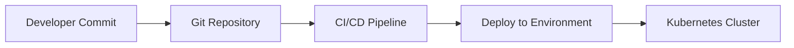
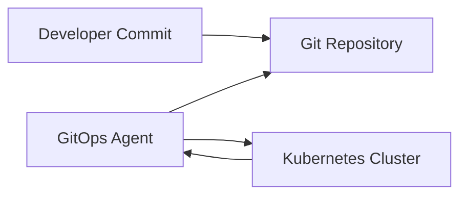

# GitOps Implementation Strategy Documentation

---
## Author Information

| **Author**   | **Created on** | **Version** | **Last updated on** | **Level** | **Reviewer**  |
|--------------|----------------|-------------|---------------------|-----------|---------------|
|Ashutosh Kumar| 2025-08-05     | 1.0         | 2025-08-05          | Internal  |Siddharth Pawar / Sahil Gupta|

---

## Table of Contents
1. [Introduction](#introduction)
2. [What is GitOps?](#what-is-gitops)
3. [Why GitOps?](#why-gitops)
4. [Types of GitOps Workflows](#types-of-gitops-workflows)
5. [GitOps Tools Comparison](#gitops-tools-comparison)
6. [Implementation Strategies](#implementation-strategies)
7. [Best Practices and Recommendations](#best-practices-and-recommendations)
8. [Conclusion](#conclusion)
9. [Contact Information](#contact-information)
10. [References](#references)

---

## 1. Introduction

GitOps uses Git as the single source of truth for infrastructure and application deployments. This document outlines our implementation strategy for adopting GitOps practices.

#### **Key Goals:**
  - Automate deployments using Git workflows
  - Improve security and auditability
  - Reduce manual errors and deployment time

---

## 2. What is GitOps?

### 2.1 Definition

GitOps is a modern operational framework utilizing Git workflows for infrastructure and application management. It extends Infrastructure as Code (IaC) by making Git the central hub for all operational activities, from development to production deployment.

> **Reference:** [GitOps Principles - CNCF GitOps Working Group](https://opengitops.dev/)

### 2.2 Core Components

- **Git Repository:** The single source of truth for configuration, policies, and deployment specs.
- **GitOps Agent/Operator:** Continuously monitors Git and ensures the environment matches the desired state.
- **Deployment Target:** The infrastructure or application environment (commonly Kubernetes).
- **Monitoring & Observability:** Tools providing feedback on deployment status and system health.

### 2.3 Key Characteristics

- **Declarative Configuration:** Desired end state defined in code.
- **Version Controlled:** Every change is tracked via Git.
- **Automated Reconciliation:** Agents reconcile actual state with Git-defined desired state.
- **Pull-Based Deployment:** Changes are pulled from Git by agents, not pushed by external systems.

---

## 3. Why GitOps?

### 3.1 Business Value Proposition

| Business Impact            | Description                                                          | Quantifiable Benefit                    |
|---------------------------|----------------------------------------------------------------------|-----------------------------------------|
| Accelerated Time-to-Market| Streamlined deployment and reduced release cycles                    | 30-50% reduction in deployment time     |
| Enhanced Security         | Audit trails and controlled Git-based access                         | 90% improvement in change traceability  |
| Operational Reliability   | Automated rollbacks and consistent deployments                       | 40-60% reduction in deployment incidents|
| Developer Productivity    | Familiar Git workflows, reduced onboarding time                      | 25-35% increase in developer velocity   |

### 3.2 Technical Advantages

#### 3.2.1 Version Control and Auditability
- Complete change history, author attribution
- Diff and rollback capabilities
- Compliance-ready audit trails

#### 3.2.2 Security and Access Control
- Least privilege (agents only need Git read access)
- Signed commits, policy as code, secret management integration

#### 3.2.3 Consistency and Standardization
- Environment parity, drift prevention, standardized workflows

> **Reference:** [NIST Cybersecurity Framework GitOps Alignment](https://opengitops.dev/)

---

## 4. Types of GitOps Workflows

### 4.1 Push-Based GitOps Workflow

#### Architecture Overview



**Characteristics:**  
- External CI/CD triggers deployments  
- CI/CD needs credentials to environments  
- Immediate deployments, but risk of drift and security concerns

**Use Cases:**  
- Legacy systems, hybrid clouds, existing CI/CD pipelines

| Advantages                | Disadvantages                        |
|---------------------------|--------------------------------------|
| Familiar to DevOps teams  | Security risks with credentials      |
| Fast initial deployments  | Potential configuration drift        |
| Integrates with existing tools | Less observability               |

### 4.2 Pull-Based GitOps Workflow (**Recommended**)

#### Architecture Overview



**Characteristics:**  
- Agents inside cluster monitor Git and reconcile state  
- Strong security, no external credentials  
- Automatic drift correction

**Use Cases:**  
- Cloud-native, Kubernetes-centric, security-conscious orgs

| Advantages                  | Disadvantages                         |
|-----------------------------|---------------------------------------|
| Enhanced security posture   | Learning curve for traditional teams  |
| Automatic drift correction  | Requires agent installation           |
| Better observability        | Dependency on agent availability      |

### 4.3 Hybrid GitOps Workflow

- Combines push and pull-based approaches for complex or transitional needs.
- Useful for multi-cloud, legacy integration, or progressive migration.

> **Reference:** [GitOps Patterns and Practices - CNCF](https://github.com/cncf/tag-app-delivery/tree/main/gitops-wg)

---

## 5. GitOps Tools Comparison

### 5.1 Evaluation Criteria
- Ease of Implementation
- Scalability
- Integration Capabilities
- Community Support
- Enterprise Features

### 5.2 Tool Analysis

| Tool         | Type      | Strengths                       | Weaknesses                   | Use Case                        | License     | Support      |
|--------------|-----------|---------------------------------|------------------------------|----------------------------------|-------------|--------------|
| ArgoCD       | Pull      | UI, RBAC, Multi-cluster         | Resource intensive           | Enterprise K8s                   | Apache 2.0  | Comm/Comm.   |
| Flux         | Pull      | Lightweight, Helm integration   | CLI-heavy, limited UI        | Cloud-native orgs                | Apache 2.0  | Community    |
| Jenkins X    | Hybrid    | CI/CD integration, Previews     | Complexity                   | Jenkins-based teams              | Apache 2.0  | Community    |
| Fleet        | Pull      | Multi-cluster, Rancher          | Newer, smaller ecosystem     | Large-scale K8s                  | Apache 2.0  | Commercial   |
| Weave GitOps | Pull      | Enterprise, Policy, Compliance  | Commercial, Flux dependency  | Compliance-focused enterprise    | Apache 2.0/Commercial | Commercial |

### 5.3 Tool Selection Matrix

| Org Profile           | Primary      | Alternative   | Rationale                           |
|---------------------- |------------- |-------------- |-------------------------------------|
| Large Enterprise      | ArgoCD       | Weave GitOps  | UI, RBAC, audit                     |
| Cloud-Native Startup  | Flux         | ArgoCD        | Lightweight, rapid deployment       |
| Multi-Cloud           | ArgoCD       | Fleet         | Multi-cluster, flexibility          |
| Legacy Integration    | Jenkins X    | ArgoCD        | Hybrid, CI/CD integration           |

---

## 6. Implementation Strategies

### 6.1 Phased Implementation

#### Phase 1: Foundation (Months 1-2)
- Set up Git repo structure
- Install/configure GitOps tool (e.g., ArgoCD)
- Pilot deployment
- Monitoring/alerting
- Team training

#### Phase 2: Expansion (Months 3-4)
- Migrate more apps
- Implement RBAC/multi-env
- Backup/disaster recovery
- Develop documentation/runbooks

#### Phase 3: Optimization (Months 5-6)
- Policy as code
- Advanced monitoring/observability
- Performance tuning

### 6.2 Repository Strategies

#### Mono-repo

```
gitops-configurations/
├── applications/
├── infrastructure/
└── clusters/
```
- Centralized, easier cross-app changes, but can get large and complex

#### Multi-repo

- `infrastructure-gitops`, `app1-gitops`, etc.
- Separation of concerns, team-specific access, but higher operational overhead

> **Reference:** [GitOps Repository Patterns Guide](https://opengitops.dev/)

---

## 7. Best Practices and Recommendations

### Security

- Never store secrets in Git; use external secret managers
- Enforce branch protection, require signed commits
- Least privilege and regular access reviews
- Agents in secure networks; use private repos

### Operational Excellence

- Monitor deployments, drift, resource usage, security events
- Regular backups and disaster recovery drills
- Approval workflows and automated testing
- Document rollback and change management

### Team Adoption

- Comprehensive GitOps training and workshops
- Internal docs and labs
- Appoint GitOps champions and foster community

---

## 8. Conclusion

GitOps enables secure, reliable, and repeatable infrastructure and application management. By following a phased, best-practices-driven implementation, organizations can achieve:

- 30-50% reduction in deployment incidents
- 40-60% faster, more reliable deployments
- 90% better auditability and compliance
- 25-35% increase in developer productivity

---

## 9. Contact Information

| Name   | Email                      |
|--------|----------------------------|
| Ashutosh Kumar  | [ashutosh.kumar.snaatak@mygurukulam.co](mailto:ashutosh.kumar.snaatak@mygurukulam.co) |

---

## 10. References

| Source | Link |
|--------|------|
| OpenGitOps Principles | https://opengitops.dev/ |
| CNCF GitOps WG | https://github.com/cncf/tag-app-delivery/tree/main/gitops-wg |
| Kubernetes GitOps Best Practices | https://kubernetes.io/docs/concepts/overview/working-with-objects/ |
| ArgoCD Docs | https://argo-cd.readthedocs.io/ |
| Flux Docs | https://fluxcd.io/docs/ |

---
